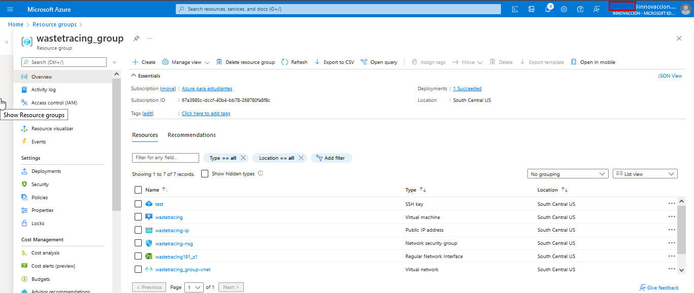
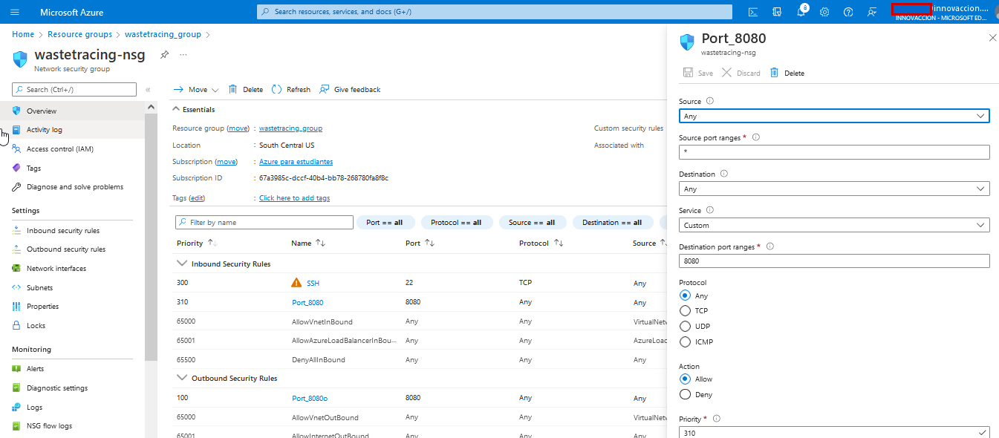
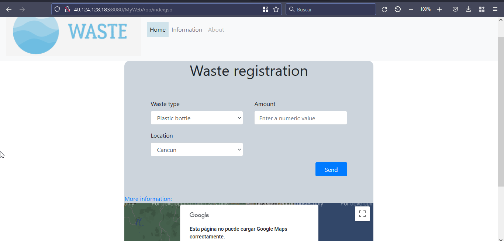
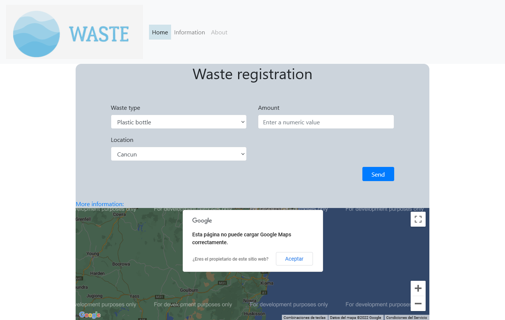
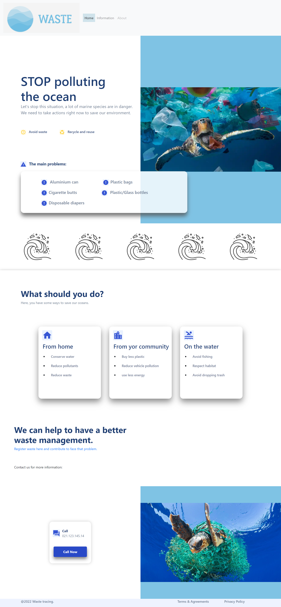
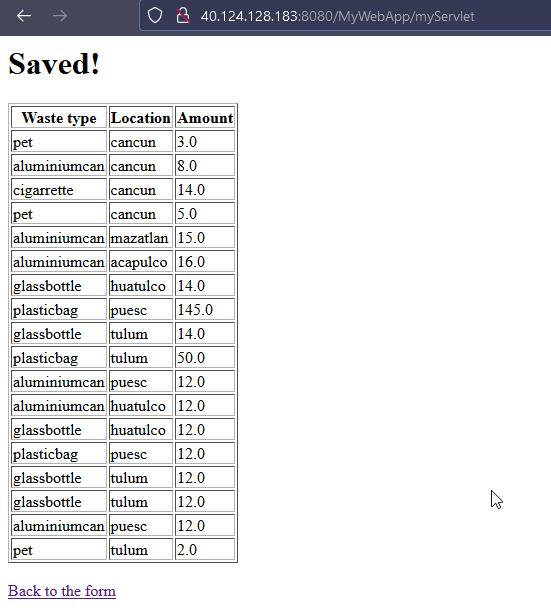

# Waste tracing app

WebApp con Jakarta y Docker basada en el repositorio de la MC Fernanda Ochoa.

https://github.com/FernandaOchoa/JakartaDocker

Link de la aplicación web [WasteTracing](http://40.124.128.183:8080/MyWebApp/)

<h2>Despliegue del Proyecto en Azure</h2>

Para desplegar el proyecto en Azure creamos una máquina virtual(VM)
<br>
Azure automaticamente nos creó los recurcusos necesarios para conectarnos a la VM



En la VM se tuvo que instalar docker y se hizo un ``` git clone ``` de nuestro repositorio

Con docker compose se desplegó la aplicación web


Para poder conectarse a la aplicación web se tuvo que abrir el puerto 8080 con las reglas de los grupos de seguridad de red (NSG)



Y con la IP pública proporcionada por Azure nos pudimos conectar a nuestra aplicación




<h3> Capturas de Pantalla </h3>

Registro de datos



Info 



Registro de la Base de Datos

